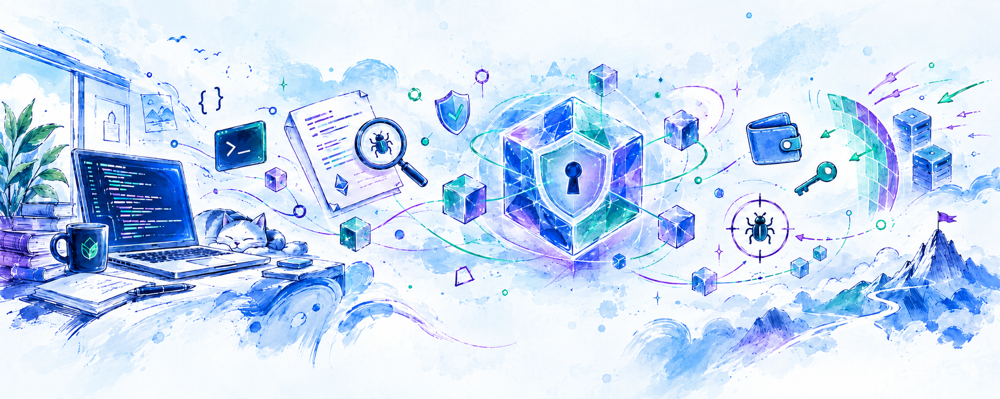
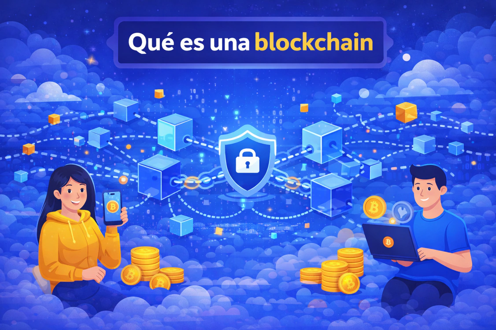

 

  <strong>Web3 Security Researcher · Rust & TypeScript</strong>

  Construyo herramientas de análisis y auditoría para protocolos blockchain,
  aplicaciones de alto rendimiento y productos seguros y escalables.

  

## 🐞 BugBounty

<table width="100%">
	<tr><th>Report</th><th>Language</th><th>Severity</th><th>Bounty</th></tr>
	<tr><td>StabilityPool Withdrawal via Nominal ICR Check</td><td>Solidity</td><td>Medium</td><td>Duplicate (Valid)</td></tr>
</table>

## 📖 Artículos

### ¿Qué es una Blockchain?

En este [artículo](https://rogergomezm.dev/articles?article=blockchain) aprenderás qué es y cómo funciona una blockchain.

### Artículos de Seguridad

<table>
	<tr width="100%">
		<td align="center" width="50%">
			<h4>Blacklist bypass por un missing check</h4>
			
			  
			
			  
			

				Vulnerabilidad en la lógica de cooldown que permitía a usuarios restringidos retirar fondos desde estados no protegidos por la blacklist.
			

		</td>
		<td align="center" width="50%">
			<h4>DoS en renovaciones provocado por transfer()</h4>
			
			  
			
			  
			

				Cómo un reembolso de ETH con gas fijo puede provocar un DoS silencioso y revertir por completo un lote de renovaciones.
			

		</td>
	</tr>
</table>
